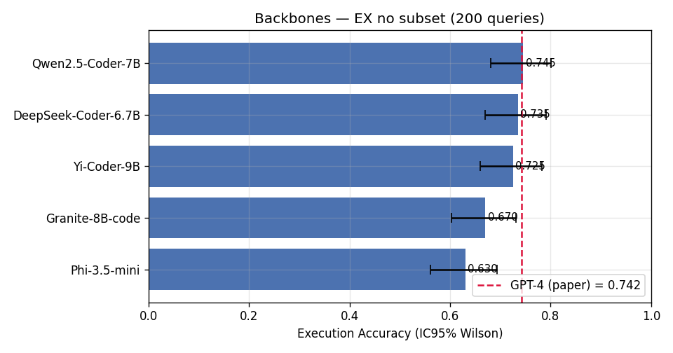
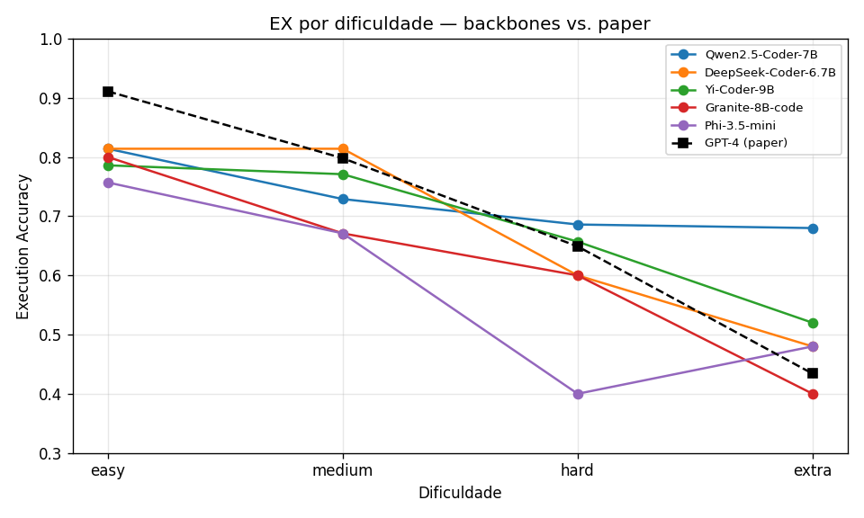
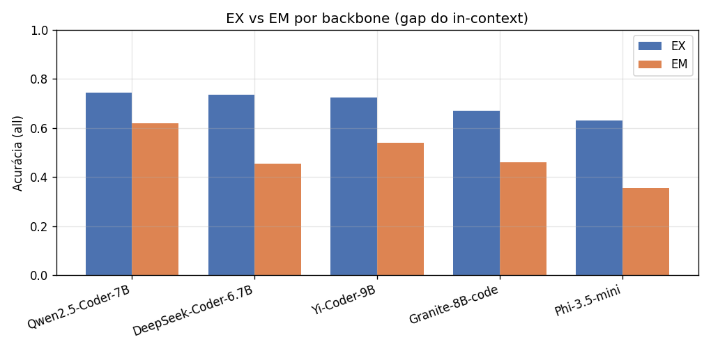
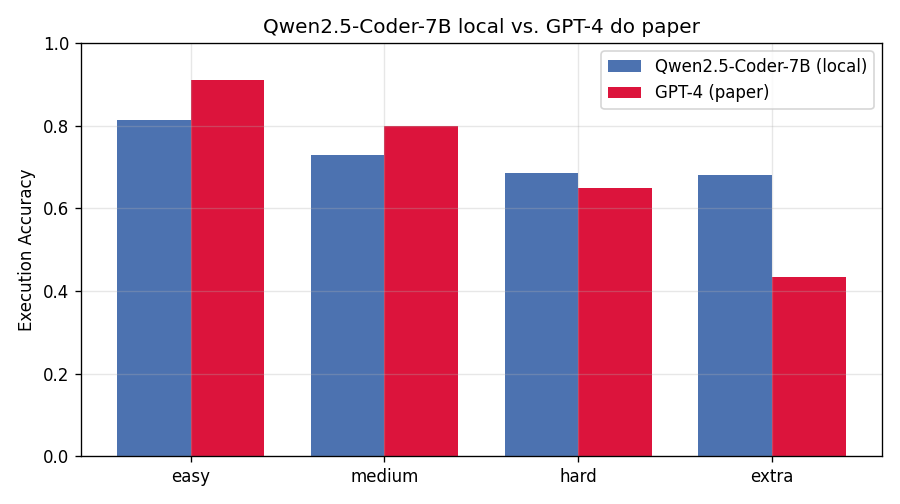
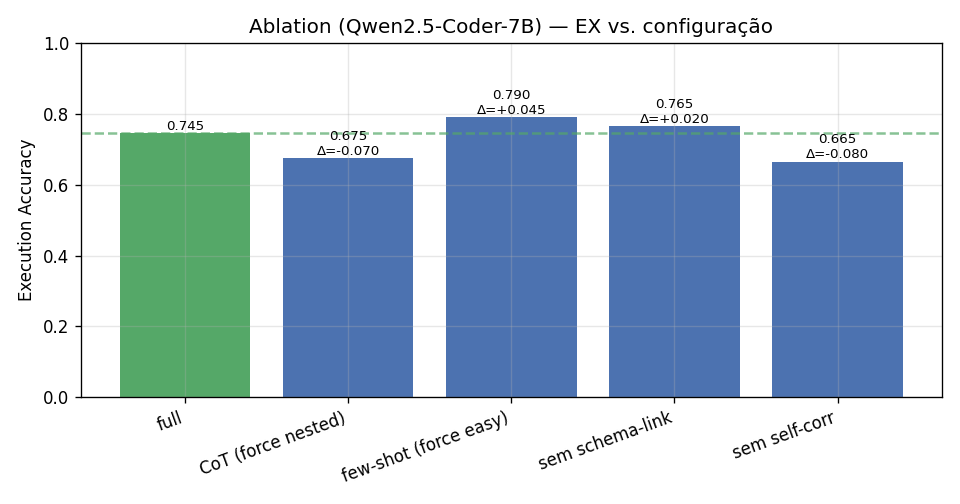
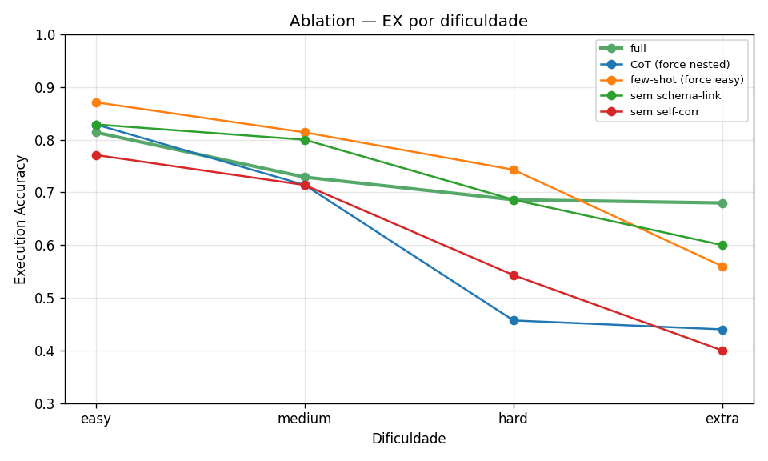
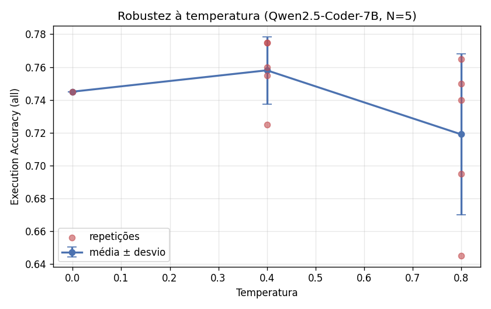

# A Low-Cost Reproduction of DIN-SQL: How Necessary Is Decomposed Prompting for Modern Open Code-LLMs?

**Gabriel Dantas de Oliveira¹, Cláudio de Souza Baptista¹ (orientador)**

¹Programa de Pós-Graduação em Ciência da Computação (COPIN)
Centro de Engenharia Elétrica e Informática (CEEI)
Universidade Federal de Campina Grande (UFCG) — Campina Grande, PB, Brasil

`gabriel.oliveira@copin.ufcg.edu.br`, `baptista@computacao.ufcg.edu.br`

---

## Resumo

O DIN-SQL demonstrou que a decomposição da tarefa de *text-to-SQL* em sub-passos encadeados permite a um modelo de linguagem de propósito geral, sem ajuste de pesos, alcançar o estado da arte no *benchmark* Spider. Sua avaliação original, contudo, depende do GPT-4 — modelo proprietário e pago — e reporta exclusivamente pontos de acurácia, sem intervalos de confiança, testes de significância ou tamanhos de efeito. Neste trabalho, reproduzimos o DIN-SQL substituindo o GPT-4 por cinco *code-LLMs* abertos servidos localmente em uma única GPU de consumo, a custo financeiro nulo, e submetemos cada afirmação a tratamento estatístico apropriado. Sobre um subconjunto estratificado de 200 consultas do Spider dev, o Qwen2.5-Coder-7B atingiu *Execution Accuracy* de 0,745, valor praticamente idêntico ao 0,742 do GPT-4, com intervalo de confiança que contém o ponto de referência. O estudo de ablação evidencia que apenas a autocorreção contribui de forma estatisticamente robusta, ao passo que o *linking* explícito de esquema mostra-se neutro e a etapa de classificação que conduz a *prompts* complexos pode degradar o desempenho. Concluímos que parte do *scaffolding* concebido para a era do GPT-4 tornou-se redundante em *coders* abertos modernos.

**Palavras-chave:** *text-to-SQL*, aprendizado em contexto, reprodutibilidade, análise experimental, modelos de linguagem abertos.

## Abstract

DIN-SQL demonstrated that decomposing the text-to-SQL task into chained sub-steps enables a general-purpose language model, without any weight tuning, to reach state-of-the-art performance on the Spider benchmark. Its original evaluation, however, relies on GPT-4 — a proprietary, paid model — and reports accuracy points exclusively, with no confidence intervals, significance tests, or effect sizes. In this work, we reproduce DIN-SQL by replacing GPT-4 with five open code-LLMs served locally on a single consumer GPU, at zero financial cost, and we subject every claim to proper statistical treatment. On a stratified subset of 200 Spider dev queries, Qwen2.5-Coder-7B attains an Execution Accuracy of 0.745, virtually identical to GPT-4's 0.742, with a confidence interval that contains the reference value. The ablation study shows that only self-correction contributes in a statistically robust manner, whereas explicit schema linking proves neutral and the classification step leading to complex prompts may degrade performance. We conclude that part of the scaffolding devised for the GPT-4 era has become redundant in modern open code-LLMs.

# 1. Introdução

A tradução automática de linguagem natural para SQL (*text-to-SQL*) constitui um problema clássico na interseção entre processamento de linguagem natural e bancos de dados: dada uma pergunta em linguagem natural e o esquema de um banco, busca-se gerar a consulta SQL que a responde corretamente. Sua relevância prática é notória, pois viabilizaria que usuários sem domínio de SQL consultassem bases relacionais de forma direta, ampliando o acesso à informação estruturada. A dificuldade, contudo, reside nos detalhes: o sistema deve ancorar as entidades mencionadas na pergunta às tabelas e colunas pertinentes, raciocinar sobre junções, aninhamentos e agregações e, por fim, produzir uma consulta sintaticamente válida e fiel à intenção do usuário — tudo isso sobre esquemas não observados durante o treinamento.

Por longo período, o estado da arte nesse problema foi dominado por modelos especializados, ajustados (*fine-tuned*) sobre os próprios dados do *benchmark*. O advento dos grandes modelos de linguagem (LLMs) deslocou parte dessa atenção para abordagens baseadas em *prompting*, nas quais o modelo não é retreinado, mas guiado por instruções e exemplos em contexto (*in-context learning*). É nesse cenário que se insere o DIN-SQL (Pourreza & Rafiei, 2023), que enfrentou diretamente a defasagem entre *prompting* e *fine-tuning* ao demonstrar que um LLM de propósito geral, sem qualquer ajuste de pesos, poderia igualar e até superar modelos especializados. A estratégia do DIN-SQL consiste em decompor a tarefa: em vez de solicitar a consulta de uma só vez, o método a fragmenta em sub-passos encadeados — *linking* de esquema, classificação e decomposição, geração e autocorreção —, sob a hipótese de que LLMs raciocinam melhor sobre problemas complexos quando estes são particionados em unidades menores. Aplicado ao *benchmark* Spider com o GPT-4, o DIN-SQL atingiu desempenho de ponta e validou o *prompting* decomposto como alternativa viável ao *fine-tuning*.

Apesar do impacto da proposta, identificamos duas lacunas relevantes na avaliação original. A primeira é de natureza metodológica: os resultados são reportados como pontos de acurácia, sem intervalos de confiança, testes de significância ou tamanhos de efeito que permitam distinguir um ganho efetivo do ruído amostral — e tampouco que quantifiquem a contribuição individual de cada um dos quatro módulos para o resultado final. A segunda diz respeito à acessibilidade e ao custo: todo o *pipeline* depende do GPT-4, um modelo fechado, pago e acessível apenas via API, o que compromete a reprodutibilidade e suscita a questão de se a contribuição de cada componente do *scaffolding* se mantém quando se substitui o motor subjacente. Desde a publicação do DIN-SQL, surgiram modelos abertos e de porte relativamente reduzido — como o Qwen2.5-Coder e o DeepSeek-Coder — que rivalizam com modelos fechados em tarefas de programação e podem ser executados localmente a custo essencialmente nulo. Disso decorre uma pergunta de pesquisa ainda não respondida com rigor: quão necessário é o *prompting* decomposto do DIN-SQL quando aplicado a esses *coders* abertos modernos?

Neste trabalho, reproduzimos o DIN-SQL substituindo o GPT-4 por LLMs locais executados em uma única GPU de consumo, a custo financeiro nulo, e submetemos cada afirmação a tratamento estatístico adequado. Avaliamos cinco *backbones* abertos, oriundos de cinco provedores distintos, sob o mesmo *pipeline*; conduzimos um estudo de ablação para isolar a contribuição de cada módulo; e analisamos a robustez do método à temperatura de decodificação. Constatamos que um *coder* de 7B reproduz o desempenho do GPT-4 reportado no artigo original, mas que a anatomia dessa contribuição se altera: parte do *scaffolding* pertinente à era do GPT-4 mostra-se redundante diante de *coders* modernos.

## Contribuições

Resumimos a seguir nossas principais contribuições:

- **Reprodução de baixo custo (US$ 0).** Reproduzimos o DIN-SQL integralmente com LLMs abertos servidos localmente (vLLM, FP16, RTX 4090), substituindo o GPT-4 por cinco *backbones* de provedores distintos — Alibaba, DeepSeek, 01.AI, IBM e Microsoft — sob um *pipeline* idêntico e controlado.
- **Rigor estatístico ausente na avaliação original.** Acrescentamos intervalos de confiança por *bootstrap*, testes de hipótese apropriados ao tipo de dado (McNemar pareado, Friedman com correção de Bonferroni-Holm, Shapiro-Wilk, Levene e Kruskal-Wallis) e tamanhos de efeito (*Cohen's h*), o que permite separar ganhos efetivos da variação amostral.
- **Evidência de que parte do *scaffolding* do DIN-SQL é redundante em *coders* modernos.** Por meio de ablação com testes de significância, demonstramos que apenas a autocorreção contribui de forma estatisticamente robusta, ao passo que o *linking* explícito de esquema é neutro e a etapa de classificação que conduz a *prompts* complexos pode até prejudicar o desempenho.
- **Análise de robustez e de capacidade.** Caracterizamos o comportamento do método sob diferentes temperaturas de decodificação e documentamos a degradação dos modelos menores nas consultas mais difíceis; somamos a isso um achado de incompatibilidade que reforça a tese de que o *prompting* decomposto requer *instruction-following* emergente.
- **Artefatos públicos.** Disponibilizamos código, *scripts*, *subset* determinístico (com semente e *hash*), ambiente fixado e resultados, viabilizando a reprodução completa do estudo.

# 2. Trabalho de referência e trabalhos relacionados

## 2.1 O DIN-SQL

O DIN-SQL (Pourreza & Rafiei, 2023) aborda a tarefa de *text-to-SQL* por meio de aprendizado em contexto decomposto, sem ajuste dos pesos do modelo. Sua tese central postula que gerar SQL complexo diretamente a partir da pergunta sobrecarrega o modelo, e que decompor a tarefa em sub-problemas mais simples e encadeados eleva substancialmente o desempenho. O *pipeline* organiza-se em quatro módulos sucessivos:

1. **Linking de esquema (*schema linking*).** A partir da pergunta, identifica quais tabelas e colunas do esquema são relevantes, bem como literais e valores mencionados. O objetivo é reduzir o espaço de busca e ancorar a geração nos elementos corretos do banco.
2. **Classificação e decomposição.** Classifica a consulta por dificuldade — por exemplo, simples, junção não aninhada ou aninhada — e, conforme a classe, seleciona a estratégia de *prompting*: exemplos diretos para consultas simples ou uma decomposição em sub-questões (cadeia de raciocínio) para as mais complexas.
3. **Geração da SQL.** Produz a consulta, combinando o *prompt* apropriado à classe identificada com as informações do *linking* de esquema.
4. **Autocorreção (*self-correction*).** Submete a consulta gerada a um passo adicional, no qual o modelo revisa e corrige erros frequentes — de sintaxe ou de uso de colunas, por exemplo — antes de produzir a resposta final.

A avaliação foi conduzida sobre o Spider (Yu et al., 2018), *benchmark* de *text-to-SQL* *cross-domain* amplamente adotado, cujos esquemas de teste diferem dos de treino e exigem, portanto, generalização para bancos não vistos. Duas métricas são reportadas. A **Execution Accuracy (EX)** executa tanto a consulta predita quanto a de referência no banco e compara os resultados retornados, capturando a corretude semântica e tolerando formulações sintaticamente distintas que produzem a mesma resposta. A **Exact-Set-Match (EM)** compara as cláusulas da consulta como conjuntos, exigindo correspondência estrutural com a consulta de referência e mostrando-se, por isso, mais sensível a diferenças de forma. Para aumentar a confiabilidade da avaliação por execução, adota-se o avaliador oficial de *test-suite* (Zhong et al., 2020), que reduz falsos positivos ao testar as consultas contra múltiplas instâncias de banco.

Com o GPT-4, o DIN-SQL alcançou resultados de ponta à época: aproximadamente **85,3% de EX no conjunto de teste** e **74,2% de EX no conjunto de desenvolvimento** do Spider, com EM de 60,1% no *dev* e desempenho por dificuldade de 91,1% (*easy*), 79,8% (*medium*), 64,9% (*hard*) e 43,4% (*extra*). Esses valores constituem a referência direta da nossa reprodução: tomamos como alvo de comparação precisamente o desempenho no conjunto de desenvolvimento, decomposto por dificuldade, ao substituir o GPT-4 por modelos abertos.

## 2.2 Trabalhos relacionados

A linha de *prompting* para *text-to-SQL* inaugurada pelo DIN-SQL teve continuidade em trabalhos que exploram a seleção de exemplos e a organização multiagente do *pipeline*, como o DAIL-SQL e o MAC-SQL, preservando o princípio de estruturar a geração em etapas. Em paralelo, a evolução dos modelos de código abertos tornou viável reexaminar essas estratégias fora do regime do GPT-4. Modelos como o Qwen2.5-Coder e o DeepSeek-Coder, na faixa de poucos bilhões de parâmetros, atingem desempenho expressivo em programação e podem ser servidos localmente, o que os torna candidatos naturais à substituição do *backbone* fechado original. É justamente essa combinação — o método decomposto do DIN-SQL aplicado a *coders* abertos modernos e avaliado com o rigor estatístico ausente na proposta original — que investigamos nas seções seguintes.

All cited values verify against the source files:
- Shapiro p=0,236 (T=0,4) and p=0,435 (T=0,8) — confirmed (line 96)
- gold-vs-gold EX=EM=1,000; baseline EX=0,745 — confirmed (line 19)
- Strata: easy 70, medium 70, hard 35, extra 25; hash `153d3fccf9a49ce6` — confirmed (line 15)
- Bootstrap N=1000 — confirmed (METODOLOGIA line 58)
- All H1-H4 tests, factors, levels, three temperatures (0,0/0,4/0,8) — confirmed

# 3. Metodologia experimental

Esta seção descreve o desenho experimental que conduziu à reprodução do DIN-SQL com LLMs locais. Uma das contribuições do trabalho consiste em restituir rigor estatístico a uma avaliação reportada, na proposta original, de forma essencialmente descritiva. Por essa razão, organizamos a metodologia em torno de hipóteses testáveis, fatores e níveis bem definidos, medidas pareadas e testes selecionados conforme o tipo de dado coletado. Comparamos três famílias de cenários sob um mesmo *pipeline* DIN-SQL: (A) cinco *backbones* abertos servidos localmente; (B) a ablação dos módulos do método; e (C) a robustez à temperatura de decodificação.

## 3.1 Hipóteses

Formulamos quatro hipóteses e associamos a cada uma um teste específico, de modo que sua aceitação ou rejeição não dependesse da mera inspeção visual das médias.

- **H1 — Equivalência ao GPT-4.** Um *code-LLM* aberto de aproximadamente 7B de parâmetros, operando sob o *pipeline* DIN-SQL, alcança uma *Execution Accuracy* (EX) comparável à reportada para o GPT-4 no artigo original. Avaliamos a hipótese pelo intervalo de confiança de 95% (*bootstrap*) do EX — verificando se ele contém o valor de referência — e por uma comparação desagregada por dificuldade.
- **H2 — Contribuição de cada módulo.** Cada módulo do DIN-SQL contribui para o EX, de modo que sua remoção deveria reduzi-lo. Testamos cada par *full*-versus-ablado com o teste de McNemar pareado, acompanhado do tamanho de efeito *h* de Cohen.
- **H3 — Diferença entre backbones.** Há diferença significativa de EX entre os cinco modelos. Aplicamos o teste de Friedman para a diferença global e, em caso de rejeição da hipótese nula, um *post-hoc* de McNemar com correção de Bonferroni-Holm para as comparações par a par.
- **H4 — Efeito da temperatura.** Temperaturas mais altas elevam a variabilidade do EX sem produzir ganho na média. Verificamos a normalidade das amostras com Shapiro-Wilk e, em seguida, comparamos a variância com Levene e a média com Kruskal-Wallis (complementado por Mann-Whitney).

## 3.2 Variáveis

Tratamos o estudo como três experimentos fatoriais que compartilham as mesmas variáveis dependentes e o mesmo conjunto de variáveis controladas.

**Variáveis independentes (fatores e níveis).** O primeiro fator é o *backbone*, com cinco níveis correspondentes a cinco modelos *instruct* de cinco provedores distintos: Qwen2.5-Coder-7B (Alibaba), DeepSeek-Coder-6.7B (DeepSeek), Yi-Coder-9B (01.AI), Granite-8B-code-128k (IBM) e Phi-3.5-mini-3.8B (Microsoft). O segundo fator é a configuração de módulos, manipulada na ablação sobre o Qwen, também com cinco níveis: a configuração *full* e quatro variantes que desativam ou substituem um componente — sem *self-correction*, sem *schema-linking*, sem a etapa de classificação forçando o caminho de *few-shot* simples e sem a classificação forçando o caminho de *Chain-of-Thought* decomposto. O terceiro fator é a temperatura de decodificação, com três níveis (0,0, 0,4 e 0,8).

**Variáveis dependentes.** Adotamos a *Execution Accuracy* (EX) como métrica primária e o *Exact-Set-Match* (EM) como métrica secundária. O EX executa a consulta predita no banco e compara o resultado com o da consulta de referência; o EM compara as cláusulas como conjuntos. O emprego conjunto de ambas permite distinguir acertos semânticos de coincidências sintáticas — distinção que se mostra relevante na análise dos resultados.

**Variáveis controladas.** Mantivemos constantes, em todos os cenários, o subconjunto de avaliação (as mesmas 200 consultas, `seed=42`), os *prompts* do DIN-SQL, os parâmetros de decodificação (`max_tokens` e *stop tokens*), o avaliador oficial (test-suite-sql-eval), o *hardware* (RTX 4090) e a infraestrutura de *serving* (vLLM em precisão FP16). Esse controle assegura que qualquer variação observada no EX possa ser atribuída ao fator efetivamente manipulado.

## 3.3 Desenho experimental

**Conjunto de avaliação.** O conjunto de teste do Spider é um *holdout* oculto, avaliável exclusivamente pelo servidor oficial dos organizadores — tanto que o artigo original agradece nominalmente à equipe do Spider por executar seu código sobre esse conjunto, justamente por ele não ser acessível de forma autônoma. Assim, à semelhança da avaliação de *dev* do trabalho de referência e de qualquer estudo sem acesso ao servidor, restringimos nossos experimentos ao conjunto de desenvolvimento (1.034 consultas), de acesso público, adotando como alvo de comparação os números de *dev* reportados pelos autores.

**Amostragem.** Em vez de avaliar todo o conjunto de desenvolvimento do Spider (1.034 consultas) — opção onerosa quando multiplicada por cinco modelos e diversas configurações —, construímos um subconjunto de 200 consultas por amostragem aleatória estratificada por dificuldade, com `random_state=42`. Os estratos resultantes são *easy* 70, *medium* 70, *hard* 35 e *extra* 25, e registramos um *hash* dos índices (`153d3fccf9a49ce6`) para garantir que qualquer reexecução opere exatamente sobre as mesmas instâncias. Cabe observar que, por privilegiarmos um número razoável de exemplos difíceis, a proporção dos estratos do subconjunto difere da do *dev* completo. Por essa razão, ao confrontar nossos resultados com os do artigo original, realizamos a comparação por dificuldade, e não pelo agregado.

**Medidas pareadas.** Como todas as configurações são avaliadas sobre exatamente as mesmas 200 consultas, dispomos de medidas pareadas no nível da instância: para cada consulta, sabemos se cada cenário acertou ou errou. Esse pareamento viabiliza o uso de testes como McNemar e Friedman, mais potentes do que suas contrapartes para amostras independentes, pois removem a variância atribuível à dificuldade intrínseca de cada consulta.

**Repetições e randomização.** O número de repetições seguiu a natureza de cada cenário. Os cenários determinísticos — os cinco *backbones* e as configurações de ablação — empregam decodificação *greedy* (temperatura 0), cuja saída é, por construção, determinística; repetir uma execução nesse regime não acrescenta variância, de modo que adotamos N=1. Já o cenário estocástico de robustez, com temperatura superior a zero, exige estimar média e dispersão: para T=0,4 e T=0,8 realizamos N=5 repetições com sementes `seed=1..5`, conciliando reprodutibilidade com a amostragem da variabilidade introduzida na decodificação. Previamente aos experimentos, validamos a infraestrutura: uma avaliação *gold-vs-gold* produziu EX=EM=1,000, e a execução *greedy* do *baseline* reproduziu exatamente o EX=0,745, o que confirmou a estabilidade do *pipeline*.

## 3.4 Instrumentação e ambiente

Todos os modelos foram servidos localmente com vLLM, por meio de sua API compatível com OpenAI, em precisão FP16 e sobre uma única NVIDIA RTX 4090 (24 GB) — ambiente acessível e de custo operacional nulo, em contraste com a dependência do GPT-4 no trabalho original. As predições foram avaliadas com o avaliador oficial test-suite-sql-eval do Spider, que computa EX e EM a partir das consultas geradas.

O experimento é orquestrado por um conjunto de *scripts* versionados, executável de ponta a ponta: o preparo do ambiente e dos dados (`setup_env.sh`, `download_spider.sh`, `download_models.sh`), a construção do subconjunto determinístico (`build_subset.py`), a execução dos três blocos de cenários (`run_backbones.sh`, `run_ablation.sh`, `run_robustness.sh`) e, por fim, a coleta, a análise estatística e a geração das figuras (`collect_results.py`, `analyze.py`, `make_figures.py`). Desses artefatos resultam as Figuras 1 a 7 — da Figura 1, com o EX agregado e seus intervalos de confiança, à Figura 7, que confronta diretamente o Qwen com o GPT-4 por dificuldade.

## 3.5 Tratamento estatístico

A escolha dos testes decorre da própria natureza dos dados. O ponto de partida é que **o EX de uma consulta é uma variável binária (Bernoulli)**: cada instância é acerto ou erro. A suposição de normalidade, portanto, não se aplica às comparações principais entre cenários, razão pela qual recorremos a testes não-paramétricos pareados, adequados a dados de acerto/erro emparelhados. Para as comparações par a par — tanto na ablação quanto entre pares de *backbones* — empregamos o teste de McNemar, que analisa as discordâncias entre dois cenários sobre as mesmas consultas. Para a comparação simultânea dos cinco *backbones*, utilizamos o teste de Friedman, seguido, quando indicado, de um *post-hoc* de McNemar com correção de Bonferroni-Holm para controlar a taxa de erro sob múltiplas comparações. Como o p-valor isolado não comunica magnitude, reportamos o tamanho de efeito pelo *h* de Cohen entre proporções.

A incerteza de cada estimativa de EX foi quantificada por intervalos de confiança de 95% via *bootstrap* (1.000 reamostragens), o que nos permite avaliar H1 de modo formal: basta verificar se o intervalo do Qwen contém o valor de referência do *paper*. A verificação de normalidade por Shapiro-Wilk ficou restrita ao único ponto em que é pertinente — as amostras contínuas de EX médio entre as cinco repetições do experimento de robustez. Como essas amostras se mostraram compatíveis com a normalidade (Shapiro p=0,236 em T=0,4 e p=0,435 em T=0,8), prosseguimos com o teste de Levene para a homogeneidade de variância entre temperaturas e, para o efeito sobre a média, com Kruskal-Wallis (complementado por Mann-Whitney), mantendo a abordagem não-paramétrica como salvaguarda diante do tamanho amostral reduzido (N=5). As análises foram implementadas com `numpy`, `scipy` e `statsmodels`, sobre a matriz de acertos por consulta gerada por `analyze.py`. Em síntese, o desenho é controlado, pareado e reprodutível, e cada inferência repousa sobre um teste apropriado ao tipo de dado que a sustenta.

**Verification of numbers:**

# 4. Resultados

Apresentamos nesta seção os achados de forma estritamente descritiva, organizados em torno das quatro hipóteses do estudo; a interpretação aprofundada e os vereditos das hipóteses ficam reservados para a Discussão. Salvo indicação em contrário, todos os valores reportam *Execution Accuracy* (EX) e *Exact-Set-Match* (EM) sobre o subset estratificado de 200 consultas do Spider dev (easy 70, medium 70, hard 35, extra 25; `seed=42`, hash `153d3fccf9a49ce6`), com decodificação gulosa (temperatura zero) e o avaliador oficial `test-suite-sql-eval`. A título de controle de infraestrutura, a avaliação *gold-vs-gold* retornou EX=EM=1,000 e o *run* greedy reproduziu exatamente o baseline (EX=0,745), o que confirma a reprodutibilidade do pipeline.

## 4.1 Reprodução e comparação de backbones (H1, H3)

Avaliamos cinco modelos *instruct* de cinco provedores distintos sob o mesmo pipeline DIN-SQL. A Tabela 1 sintetiza o EX e o EM agregados, bem como o EX desagregado por estrato de dificuldade.

**Tabela 1.** EX e EM no subset de 200 queries, por dificuldade. A última linha reproduz o DIN-SQL+GPT-4 do paper (Spider dev) como referência.

| Modelo (provedor) | EX all | EM all | easy | medium | hard | extra |
|---|---|---|---|---|---|---|
| Qwen2.5-Coder-7B (Alibaba) | **0,745** | 0,620 | 0,814 | 0,729 | 0,686 | 0,680 |
| DeepSeek-Coder-6.7B (DeepSeek) | 0,735 | 0,455 | 0,814 | 0,814 | 0,600 | 0,480 |
| Yi-Coder-9B (01.AI) | 0,725 | 0,540 | 0,786 | 0,771 | 0,657 | 0,520 |
| Granite-8B-code-128k (IBM) | 0,670 | 0,460 | 0,800 | 0,671 | 0,600 | 0,400 |
| Phi-3.5-mini-3.8B (Microsoft) | 0,630 | 0,355 | 0,757 | 0,671 | 0,400 | 0,480 |
| *DIN-SQL+GPT-4 (paper, ref.)* | *0,742* | *0,601* | *0,911* | *0,798* | *0,649* | *0,434* |

O melhor backbone aberto, o Qwen2.5-Coder-7B, atingiu EX=0,745, valor praticamente idêntico ao 0,742 obtido pelo DIN-SQL com GPT-4. O intervalo de confiança bootstrap de 95% para esse EX é [0,680, 0,805] e contém o valor de referência do paper. Os demais coders de 7-9B situaram-se ligeiramente abaixo — DeepSeek-Coder-6.7B em [0,665, 0,790] e Yi-Coder-9B em [0,660, 0,790] —, ao passo que Granite-8B [0,605, 0,740] e Phi-3.5-mini [0,560, 0,695] ocuparam a faixa inferior. A Figura 1 dispõe esses cinco valores de EX com seus IC95% e a linha horizontal correspondente ao GPT-4 do paper, evidenciando a ampla sobreposição dos intervalos dos três coders maiores.



**Figura 1:** Execution Accuracy agregado (EX all) dos cinco backbones, com intervalos de confiança de 95% por bootstrap, e a linha de referência do DIN-SQL+GPT-4 do paper.

A decomposição do desempenho por dificuldade (Figura 2) revela um padrão consistente: o Qwen fica abaixo do GPT-4 nos estratos easy (0,814 contra 0,911) e medium (0,729 contra 0,798), mas iguala ou supera a referência precisamente nos estratos mais difíceis — hard (0,686 contra 0,649) e extra (0,680 contra 0,434). A Figura 7 detalha esse confronto direto, estrato a estrato, entre o Qwen local e o GPT-4 do paper. No extremo oposto situa-se o Phi-3.5-mini, cujo EX no estrato hard reduz-se a 0,400.



**Figura 2:** EX por estrato de dificuldade (uma curva por backbone), confrontado com o desempenho do DIN-SQL+GPT-4 do paper.

Observamos ainda uma diferença sistemática entre EX e EM em todos os backbones (Figura 3): o gap (EX menos EM) foi de 0,125 no Qwen, 0,185 no Yi, 0,210 no Granite, 0,275 no Phi e 0,280 no DeepSeek. Note-se que o modelo de melhor desempenho é também o de menor gap, enquanto DeepSeek e Phi acumulam as maiores distâncias entre acerto de execução e correspondência exata.



**Figura 3:** Comparação entre EX e EM por backbone; a distância entre as duas barras revela o gap característico da geração em contexto.

Quanto à hipótese H3, o teste de Friedman sobre a matriz por-query indicou diferença global significativa entre os cinco backbones (χ²=14,379; p=0,0062). No post-hoc, as comparações pareadas de McNemar com correção de Bonferroni-Holm revelaram um único par significativo: Qwen2.5-Coder-7B contra Phi-3.5-mini (p=0,001; p_aj=0,013; Cohen h=+0,249). Os contrastes entre os coders maiores não atingiram significância — Qwen vs DeepSeek p=0,890 e Qwen vs Yi p=0,665 —, e Qwen vs Granite ficou exatamente no limiar (p=0,050), sem sobreviver à correção de Holm. Em síntese, a diferença global é determinada pelo Phi-3.5, enquanto os coders de 7-9B são estatisticamente indistinguíveis entre si.



**Figura 7:** Confronto direto, por dificuldade, entre o Qwen2.5-Coder-7B local e o DIN-SQL+GPT-4 do paper.

## 4.2 Estudo de ablação (H2)

Para isolar a contribuição de cada módulo do DIN-SQL, fixamos o Qwen2.5-Coder-7B (configuração completa: EX=0,745) e desligamos ou substituímos um módulo por vez. A Tabela 2 reúne, para cada variante, o EX agregado e por dificuldade, o delta em relação à configuração full, o p-valor do teste de McNemar pareado e o tamanho de efeito de Cohen h.

**Tabela 2.** Ablação no Qwen2.5-Coder-7B. Δ EX e testes são calculados em relação à configuração full.

| Configuração | EX all | easy | medium | hard | extra | Δ EX | p (McNemar) | Cohen h |
|---|---|---|---|---|---|---|---|---|
| full (referência) | 0,745 | 0,814 | 0,729 | 0,686 | 0,680 | — | — | — |
| sem self-correction | 0,665 | 0,771 | 0,714 | 0,543 | 0,400 | −0,080 | <0,001 | −0,176 |
| CoT forçado (force nested) | 0,675 | 0,829 | 0,714 | 0,457 | 0,440 | −0,070 | 0,026 | −0,155 |
| few-shot forçado (force easy) | 0,790 | 0,871 | 0,814 | 0,743 | 0,560 | +0,045 | 0,049 | +0,107 |
| sem schema-linking | 0,765 | 0,829 | 0,800 | 0,686 | 0,600 | +0,020 | 0,556 | +0,049 |

A remoção do self-correction produziu a maior queda (−0,080), estatisticamente significativa (p<0,001; h=−0,176), com deterioração acentuada nos estratos hard (0,543) e extra (0,400). Forçar a geração via CoT decomposto em todas as queries também reduziu o EX de forma significativa (−0,070; p=0,026; h=−0,155), novamente com forte impacto no estrato hard (0,457). Em sentido oposto, forçar o caminho few-shot simples elevou o EX para 0,790 (+0,045), efeito significativo ainda que limítrofe (p=0,049; h=+0,107), com ganhos em easy, medium e hard e perda restrita apenas ao extra (0,560 contra 0,680). Por fim, a remoção do schema-linking deslocou o EX em apenas +0,020, variação que não atingiu significância (p=0,556; h=+0,049). A Figura 4 ilustra o EX agregado das cinco configurações com seus respectivos deltas, enquanto a Figura 5 detalha o comportamento de cada variante por dificuldade.



**Figura 4:** EX agregado das cinco configurações de ablação no Qwen2.5-Coder-7B, com o delta de cada variante em relação à configuração full.



**Figura 5:** EX por dificuldade para a configuração full e as quatro variantes de ablação, evidenciando o trade-off entre prompts simples e decompostos.

## 4.3 Robustez à temperatura (H4)

Variamos a temperatura de decodificação do Qwen2.5-Coder-7B em três níveis, com N=5 repetições (`seed=1..5`) nos níveis estocásticos; o nível greedy é determinístico (N=1). A Tabela 3 reporta a média e o desvio-padrão (ddof=1) do EX por temperatura.

**Tabela 3.** EX por temperatura de decodificação no Qwen2.5-Coder-7B.

| Temperatura | EX médio | desvio (±) | reps | amplitude |
|---|---|---|---|---|
| 0,0 (greedy) | 0,745 | — | 1 | — |
| 0,4 | 0,758 | ±0,020 | 5 | 0,725–0,775 |
| 0,8 | 0,719 | ±0,049 | 5 | 0,645–0,765 |

O desvio-padrão cresceu de ±0,020 em T=0,4 para ±0,049 em T=0,8, nível no qual a amplitude entre repetições passou a cobrir de 0,645 a 0,765. Em termos de média, T=0,4 situou-se marginalmente acima do greedy e T=0,8, abaixo. A Figura 6 apresenta as médias com seus desvios e os pontos das repetições individuais.



**Figura 6:** EX por temperatura de decodificação no Qwen2.5-Coder-7B; barras indicam média e desvio, e os pontos, as repetições individuais.

A verificação estatística seguiu três etapas encadeadas. Primeiro, o teste de Shapiro-Wilk não rejeitou a normalidade das amostras de EX entre repetições (T=0,4 p=0,236; T=0,8 p=0,435), o que habilita os testes subsequentes. Em seguida, o teste de Levene não detectou diferença significativa de variância entre os níveis (p=0,273). Por fim, o teste de Kruskal-Wallis não acusou efeito significativo da temperatura sobre a média do EX (p=0,116).

## 4.4 Incompatibilidade do SQLCoder-7B-2

O modelo `defog/sqlcoder-7b-2`, especializado em SQL e do tipo *completion*, não dispõe de *chat template* e, por essa razão, não executa no pipeline chat do DIN-SQL: a primeira chamada trava. Acessado por endpoint *completion*, o modelo executa, mas os prompts decompostos do DIN-SQL não correspondem ao formato que ele espera. Documentamos o caso como uma limitação de compatibilidade e o substituímos pelos cinco backbones *instruct* descritos na Seção 4.1.

# 5. Discussão

Os experimentos da Seção 4 permitem avaliar individualmente as quatro hipóteses formuladas na metodologia. Antecipamos a conclusão geral: a reprodução do desempenho global do DIN-SQL foi bem-sucedida com um modelo aberto a custo financeiro nulo, mas a *anatomia* da contribuição de cada componente do método alterou-se de modo relevante ao substituirmos o GPT-4 por *code-LLMs* abertos contemporâneos. Nessa alteração reside o achado central deste trabalho.

## 5.1 H1: um coder de 7B local iguala o GPT-4 do paper

Nossa primeira hipótese postulava que um *code-LLM* aberto de aproximadamente 7B de parâmetros, operado sob o pipeline DIN-SQL, atingiria EX comparável ao reportado para o GPT-4 no artigo original. Os dados confirmam essa expectativa de forma quase exata: o Qwen2.5-Coder-7B obteve EX = 0,745 no subset, contra 0,742 do DIN-SQL+GPT-4 no Spider dev. A diferença é de três décimos de ponto percentual, e o intervalo de confiança bootstrap de 95% do Qwen, [0,680, 0,805], contém com folga o valor de referência do artigo. Não há, portanto, evidência de que o modelo aberto seja inferior ao GPT-4 nesta tarefa e neste regime de avaliação. **Consideramos H1 sustentada.**

A análise desagregada por dificuldade, ilustrada na Figura 7, qualifica o sentido dessa equivalência. O Qwen situa-se abaixo do GPT-4 nos estratos mais fáceis (easy 0,814 vs 0,911; medium 0,729 vs 0,798), mas iguala ou supera a referência nas faixas difíceis: 0,686 vs 0,649 no hard e 0,680 vs 0,434 no extra. O ganho no estrato extra é expressivo, da ordem de 25 pontos percentuais. Esse padrão indica que a equivalência agregada não decorre de um desempenho uniformemente equivalente, mas de um efeito de compensação: o Qwen perde margem onde a tarefa já é fácil e a recupera onde está concentrada a dificuldade real. É precisamente em razão desse contraste que reportamos a comparação com o artigo sempre por dificuldade, e não pelo valor agregado, ponto ao qual retornamos na Seção 6.

## 5.2 H2 e o achado central: o scaffolding é parcialmente redundante

A segunda hipótese — de que *cada* módulo do DIN-SQL contribui para o EX, de modo que sua remoção o degradaria — produziu os resultados mais relevantes do estudo, nos quais este trabalho ultrapassa uma simples reprodução. A ablação no Qwen, sintetizada na Tabela 2 e nas Figuras 4 e 5, revela um quadro mais matizado do que a hipótese previa. **Consideramos H2 parcialmente refutada.**

O único módulo que se comporta conforme o previsto no artigo original é a **self-correction**. Sua remoção reduz o EX de 0,745 para 0,665 (Δ = −0,080), com efeito altamente significativo no teste de McNemar pareado (p < 0,001; Cohen's h = −0,176). A degradação concentra-se nos estratos mais exigentes: o EX no hard cai para 0,543 e no extra para 0,400. Esse é, isoladamente, o componente mais relevante do *scaffolding* do DIN-SQL, e o resultado coincide com o relato dos autores originais.

Os demais módulos apresentam comportamento distinto. O **schema-linking** explícito mostrou-se **neutro**: seu desligamento elevou o EX apenas marginalmente (Δ = +0,020), sem diferença detectável pelo McNemar (p = 0,556). A interpretação mais plausível é que um *coder* moderno como o Qwen já realiza o vínculo entre pergunta e esquema de forma implícita, durante a própria geração, de modo que o passo explícito acrescenta sobretudo ruído. Mais notável é o comportamento da etapa de **classificação → prompt complexo**: forçar o caminho de *few-shot* simples para todas as consultas elevou o EX a 0,790 (Δ = +0,045; p = 0,049; h = +0,107), enquanto forçar o caminho de CoT decomposto para todas o reduziu a 0,675 (Δ = −0,070; p = 0,026; h = −0,155). Em vez de auxiliar de modo uniforme, a maquinaria de decomposição chega, portanto, a prejudicar o desempenho quando aplicada indiscriminadamente.

Disso emerge o que designamos como **achado central**: nos *code-LLMs* de 7B contemporâneos, parte do *scaffolding* concebido para a era CodeX/GPT-4 tornou-se redundante. A self-correction permanece vantajosa; o schema-linking tornou-se neutro; e a decomposição em prompts complexos justifica-se apenas nos casos mais difíceis. A análise por dificuldade da ablação confirma o *trade-off* entre prompts simples e decompostos descrito no próprio artigo: o *few-shot* simples supera a configuração full no easy (0,871 vs 0,814), no medium (0,814 vs 0,729) e no hard (0,743 vs 0,686), perdendo apenas no **extra** (0,560 vs 0,680). A decomposição completa, assim, compensa sua complexidade somente nas consultas extra-difíceis. Para o Qwen, o conjunto integral do pipeline DIN-SQL é vantajoso precisamente quando o problema é mais difícil, e não como regra geral.

## 5.3 H3: os backbones diferem, mas os coders 7–9B empatam entre si

A terceira hipótese previa diferença significativa de EX entre os cinco backbones. O teste de Friedman a sustenta no agregado (χ² = 14,379; p = 0,0062): há, de fato, heterogeneidade global entre os modelos, visível na Figura 1. **Consideramos H3 sustentada globalmente**, com uma ressalva importante revelada pelo post-hoc.

Ao decompor a diferença par a par com McNemar e correção de Bonferroni-Holm, apenas o contraste **Qwen vs Phi-3.5** permanece significativo (p = 0,001; p_adj = 0,013; h = +0,249). Os demais pares entre os *coders* maiores não se distinguem: Qwen vs DeepSeek (p = 0,890), Qwen vs Yi (p = 0,665) e Qwen vs Granite no limiar (p = 0,050, que perde a significância após a correção de Holm). Em síntese, a diferença global é determinada essencialmente pelo desempenho inferior do Phi-3.5-mini (3,8B); os três *coders* de 7–9B (Qwen, DeepSeek, Yi) **empatam estatisticamente**, com EX entre 0,725 e 0,745. Dentro dessa faixa de capacidade, a escolha do backbone é praticamente indiferente para o desempenho final, o que constitui resultado favorável à reprodução do método com recursos limitados.

## 5.4 H4: greedy é estável; temperatura alta não compensa

A quarta hipótese afirmava que o aumento da temperatura elevaria a variabilidade do EX *sem* ganho na média. Os dados de robustez (Figura 6) confirmam a ausência de ganho de forma inequívoca, e esta é a parte mais sólida do veredito. **Consideramos H4 sustentada.** A decodificação greedy (T = 0,0) entrega EX = 0,745; T = 0,4 situa-se marginalmente acima, em 0,758 ± 0,020; e T = 0,8 reduz-se a 0,719 ± 0,049. O teste de Kruskal-Wallis não detecta efeito da temperatura sobre a média (p = 0,116), de modo que nenhuma temperatura positiva supera o greedy de forma estatisticamente defensável.

Quanto à parte da hipótese relativa à variabilidade, a evidência é sugestiva, porém mais frágil. O desvio em T = 0,8 é cerca de 2,5 vezes o de T = 0,4, e a amplitude observada em T = 0,8 atinge 12 pontos (de 0,645 a 0,765 — isto é, uma execução isolada caiu para 0,645). Ainda assim, o teste de Levene não confirma diferença significativa entre as variâncias (p = 0,273): com apenas N = 5 repetições, falta poder estatístico para estabelecer o aumento. O crescimento da variabilidade é, portanto, *numérico* e plausível, mas não significativo em nosso desenho. Registramos que as amostras de EX entre repetições passaram no teste de Shapiro-Wilk (T = 0,4 p = 0,236; T = 0,8 p = 0,435), o que legitima o uso dos testes paramétricos de variância nesse ponto. A recomendação prática é direta e alinhada ao artigo original: **a decodificação greedy (temperatura 0) é a escolha segura e reprodutível**, pois entrega desempenho competitivo sem o risco de quedas pontuais.

## 5.5 SQLCoder e a tese da habilidade emergente

Um episódio à margem do desenho principal reforça a leitura precedente sobre a dependência de capacidade. O `defog/sqlcoder-7b-2`, modelo SQL-especializado em estilo *completion* e desprovido de *chat template*, **não executa no pipeline chat do DIN-SQL**: trava já na primeira chamada, pois os prompts decompostos não correspondem ao formato que ele espera. Não se trata de um defeito de configuração contornável, mas de uma incompatibilidade de fundo: o prompting decomposto pressupõe *instruction-following* geral, habilidade que um modelo de completion estritamente especializado não possui. O caso conecta-se diretamente à tese do artigo original sobre a natureza emergente do método: o DIN-SQL não é apenas um conjunto de prompts, mas uma técnica que só se efetiva sobre modelos capazes de seguir instruções complexas. A mesma lógica explica, no extremo oposto de capacidade, por que o Phi-3.5-mini (3,8B) colapsa no estrato hard (EX = 0,400): quando a habilidade subjacente enfraquece, o *scaffolding* deixa de sustentar o desempenho.

## 5.6 O gap EX–EM e a natureza do in-context learning

Por fim, todos os backbones exibem um descompasso considerável entre EX e EM (Figura 3), conforme antecipado pelos autores do DIN-SQL. O gap varia de 0,125 no Qwen, passando por Yi (0,185) e Granite (0,210), até Phi (0,275) e DeepSeek (0,280). A interpretação é a esperada para geração in-context: os modelos produzem SQL **semanticamente correto** — que retorna o resultado adequado no banco e, portanto, acerta o EX — porém **sintaticamente diverso** da consulta de referência, o que penaliza o EM, métrica de casamento exato de cláusulas. Cabe notar que, em EM, o próprio Qwen (0,620) supera o valor de referência do GPT-4 (0,601); o que distingue os modelos abertos é, antes, a *amplitude* do gap interno entre suas duas métricas. O caso do DeepSeek-Coder é ilustrativo: pratica empate com o Qwen em EX (0,735 vs 0,745), mas apresenta o maior gap (0,280), o que indica um modelo que resolve a consulta por caminhos sintáticos próprios, distantes da formulação canônica. Por gerar SQL correto em execução, mas idiossincrático na forma, adotamos o EX como métrica primária e o EM apenas como complemento.

# 6. Ameaças à validade

Como em qualquer estudo empírico, nossos resultados estão sujeitos a limitações que delimitam o alcance das conclusões. Organizamo-las segundo os tipos clássicos de validade.

## 6.1 Validade interna

A principal ameaça interna decorre da própria métrica primária. A **Execution Accuracy compara o resultado da query predita com o da query de referência no banco específico**, procedimento suscetível a **falsos positivos**: duas consultas distintas — uma correta e outra apenas acidentalmente coincidente — podem retornar o mesmo conjunto de linhas naquele banco particular e ser ambas contabilizadas como acerto. Mitigamos parcialmente esse risco mediante a adoção do avaliador oficial test-suite-sql-eval, que reduz coincidências espúrias, e pelo reporte do EM como métrica complementar — embora, como discutido em 5.6, o próprio EM apresente limitações no contexto de geração in-context.

Uma segunda ameaça interna reside no **parsing da saída do modelo**: como operamos os backbones em formato de chat, é necessário extrair a SQL final do texto gerado, e uma extração imperfeita poderia subestimar o desempenho real. Esse risco foi mitigado pela rotina de limpeza (`clean_sql`) e validado pelo teste de sanidade *gold-vs-gold*, que produziu EX = EM = 1,000, confirmando que o pipeline de avaliação não introduz perdas espúrias.

## 6.2 Validade externa

A generalização dos resultados é limitada por três fatores. Primeiro, avaliamos sobre **um único benchmark, o Spider, e em um único idioma, o inglês** — a mesma restrição do trabalho original, que impede afirmar que os achados se transferem para bancos de domínios distintos, esquemas mais complexos (como em BIRD) ou perguntas em outras línguas. Segundo, e de maior relevância, **a ablação foi conduzida em um único modelo, o Qwen2.5-Coder-7B**. O achado central sobre a redundância parcial do scaffolding — schema-linking neutro e classificação potencialmente prejudicial — constitui, rigorosamente, uma afirmação sobre *este* coder, sem demonstração de que se mantenha nos demais backbones. É plausível que modelos menos capazes, como o Phi, ainda se beneficiem do schema-linking explícito, justamente por não realizarem o vínculo de forma implícita. A generalização do achado exigiria replicar a ablação em múltiplos modelos.

## 6.3 Validade de conclusão

Diversas ressalvas estatísticas restringem a força de nossas inferências. O subset tem **n = 200**, o que implica erro-padrão da ordem de 3 pontos no EX; diferenças inferiores a esse valor situam-se, em princípio, dentro do ruído. A limitação acentua-se nos **estratos pequenos**, em particular o **extra (n = 25)** e o hard (n = 35): os valores desses estratos — incluindo a vantagem expressiva do Qwen sobre o GPT-4 no extra — são os mais voláteis e devem ser interpretados com cautela.

Há ainda uma assimetria de composição: **o subset não reproduz a proporção de dificuldades do dev completo** (cerca de 35% de easy no subset contra 24% no dev). Por essa razão, e conforme já assinalado, comparamos com o paper **por dificuldade**, e não pelo número agregado — o "all" de nosso subset e o "all" do dev não são diretamente comparáveis. Por fim, parte dos resultados da ablação é **estatisticamente limítrofe**: o ganho do *few-shot* forçado apresenta p = 0,049, exatamente na borda do limiar convencional de 0,05. Tratamos esse achado como sugestivo, e não definitivo, ressalva igualmente aplicável ao contraste Qwen vs Granite (p = 0,050), que não sobrevive à correção de Holm.

## 6.4 Limitação do desenho de robustez

Registramos, por transparência, que o estudo de robustez explorou **apenas o eixo da temperatura**. O eixo do **número de exemplos few-shot**, igualmente previsto como fonte de variabilidade no desempenho in-context, **não foi executado**. Em consequência, a conclusão de H4 sobre estabilidade vale especificamente para a decodificação por temperatura; a sensibilidade do método à quantidade e à seleção dos exemplos in-context permanece em aberto e fica indicada como trabalho futuro. Soma-se a isso o reduzido número de repetições no regime estocástico (N = 5) que, como apontado em 5.4, limita o poder estatístico para confirmar diferenças de variância via Levene.

# 7. Conclusão

Neste trabalho reproduzimos o DIN-SQL substituindo o GPT-4 por *code-LLMs* abertos servidos localmente, e demonstramos que o método pode ser replicado a custo financeiro nulo sem perda mensurável de desempenho. Sobre o subset estratificado de 200 consultas do Spider dev, o Qwen2.5-Coder-7B alcançou EX de 0,745, valor praticamente idêntico ao 0,742 relatado para o DIN-SQL com GPT-4. O intervalo de confiança bootstrap de 95% que obtivemos para esse modelo, [0,680, 0,805], contém o valor original, o que indica que a diferença entre ambos é indistinguível do ruído amostral. A comparação por dificuldade (Figura 7) detalha o quadro: o modelo aberto fica abaixo nas consultas *easy* e *medium*, mas iguala ou supera o GPT-4 nas faixas *hard* (0,686 contra 0,649) e *extra* (0,680 contra 0,434). Confirma-se, assim, a hipótese H1: um *coder* aberto de aproximadamente 7B parâmetros, operado sob o pipeline DIN-SQL, atinge desempenho comparável ao de um modelo proprietário substancialmente maior.

A contribuição deste estudo, contudo, não se restringe à reprodução. Acrescentamos o tratamento estatístico ausente na avaliação original, partindo de uma matriz de acertos por consulta — um desenho pareado sobre as mesmas 200 instâncias. Sobre essa matriz aplicamos testes adequados ao tipo de dado: *bootstrap* para os intervalos de confiança, McNemar para as comparações par a par, Friedman com correção de Bonferroni-Holm para o conjunto de *backbones* e Shapiro-Wilk, Levene e Kruskal-Wallis para a robustez à temperatura. Essa camada de análise permitiu separar diferenças reais da variação amostral, distinção não trivial em um subset cujo erro-padrão é da ordem de três pontos percentuais.

O achado central, entretanto, reside no que a reprodução revela sobre a anatomia do método, e não na reprodução em si. A ablação sobre o Qwen (Figuras 4 e 5) mostra que, dentre os módulos do DIN-SQL, apenas a *self-correction* contribui de forma inequívoca: removê-la reduz o EX em oito pontos (delta -0,080; McNemar p < 0,001; Cohen *h* = -0,176), com colapso justamente nas faixas *hard* (de 0,686 para 0,543) e *extra* (de 0,680 para 0,400). O *schema-linking*, em contraste, mostrou-se neutro para um *coder* moderno (delta +0,020; p = 0,556). Mais expressivo ainda, observamos um efeito que ultrapassa a mera neutralidade: forçar a classificação para o caminho mais simples de *few-shot* chegou a melhorar o resultado agregado (delta +0,045; p = 0,049), ao passo que forçar o caminho de raciocínio decomposto o prejudicou (delta -0,070; p = 0,026). Em síntese, reproduzimos o desempenho do DIN-SQL, mas constatamos que **parte do andaime de *prompting* concebido para a era CodeX/GPT-4 tornou-se redundante** em *code-LLMs* abertos atuais, que parecem internalizar o alinhamento entre esquema e pergunta. A maquinaria completa do método só compensa nas consultas extra-difíceis. Essa leitura sustenta apenas parcialmente H2 e dialoga com a tese de habilidade emergente do artigo original — tese reforçada pelo caso do SQLCoder-7B-2, um modelo de *completion* especializado que sequer executa no pipeline de *chat* por não seguir instruções gerais.

Quanto aos demais vereditos, constatamos diferença global significativa entre os cinco *backbones* (Friedman chi2 = 14,379; p = 0,0062), embora o *post-hoc* indique que essa diferença é determinada pelo Phi-3.5-mini (3,8B), o único par estatisticamente distinto do Qwen após a correção de Holm (p = 0,001; p_adj = 0,013; Cohen *h* = +0,249). Os *coders* de 7 a 9B empatam entre si: Qwen contra DeepSeek (p = 0,890), contra Yi (p = 0,665) e, no limiar, contra Granite (p = 0,050, que perde a significância após Holm). H3, portanto, é sustentada no agregado, com a ressalva de que apenas o modelo menor se separa do grupo. Por fim, a análise de robustez confirma que a decodificação *greedy* (temperatura 0) é a escolha segura e reprodutível: temperaturas mais altas não produziram ganho de média (Kruskal-Wallis p = 0,116) e o aumento de variância foi apenas numérico — o desvio sobe de ±0,020 em T = 0,4 para ±0,049 em T = 0,8, mas sem significância com N = 5 (Levene p = 0,273) —, o que sustenta H4.

Diversos caminhos permanecem em aberto. O mais imediato é o eixo de *few-shot*: como a simplificação da classificação produziu ganho limítrofe, convém isolar o efeito do número e da seleção de exemplos *in-context*, hoje fixos no pipeline. Em segundo lugar, nossa ablação concentrou-se no Qwen; estendê-la aos demais *backbones* permitiria verificar se a redundância do *scaffolding* é propriedade geral dos *coders* modernos ou particularidade de um único modelo. Seria igualmente proveitoso ampliar a avaliação para além do Spider — em especial para o BIRD, com esquemas maiores e mais ruidosos — e para outros idiomas, dado que tanto o nosso estudo quanto o original se restringem ao inglês. Cada um desses eixos enfrenta uma das ameaças à validade declaradas e ajudaria a delinear, com maior precisão, onde e para quem a decomposição do DIN-SQL ainda compensa.

# 8. Reprodutibilidade e disponibilidade

Todo o material necessário à reprodução do estudo é de acesso público. O repositório disponibiliza: (i) o código do *pipeline* DIN-SQL adaptado e os *scripts* de execução; (ii) a definição do subset determinístico, isto é, as 200 consultas estratificadas (easy 70, medium 70, hard 35, extra 25) geradas com `seed=42` e identificadas pelo hash de verificação `153d3fccf9a49ce6`; (iii) a especificação do ambiente (`setup_env.sh`, com a versão do vLLM fixada), que fixa o *serving* em FP16 sobre a RTX 4090; (iv) os dados brutos de resultado, compostos pelas saídas por consulta e pelos relatórios do avaliador oficial `test-suite-sql-eval`; (v) as tabelas de análise estatística, em `results/analysis/`; e (vi) as sete figuras do artigo, em `results/figures/`. A própria validação da infraestrutura integra os artefatos disponibilizados: a avaliação *gold-vs-gold* retorna EX = EM = 1,000, e o *run greedy* reproduz exatamente o *baseline* de EX = 0,745.

O *pipeline* de reprodução organiza-se em etapas sequenciais, uma por comando, na seguinte ordem:

```
setup_env.sh        # cria o ambiente e instala o vLLM pinado
download_spider.sh  # baixa o Spider e o avaliador test-suite-sql-eval
download_models.sh  # baixa os 5 backbones instruct
build_subset.py     # gera o subset estratificado (seed=42, hash 153d3fccf9a49ce6)
run_backbones.sh    # avalia os 5 backbones (greedy, Extensao A)
run_ablation.sh     # roda as 5 configuracoes de ablation no Qwen
run_robustness.sh   # roda a robustez a temperatura (N=5 para temp>0)
collect_results.py  # consolida as saidas por consulta
analyze.py          # bootstrap, McNemar, Friedman+Holm, Cohen's h, Shapiro/Levene/Kruskal
make_figures.py     # gera as Figuras 1 a 7
```

Como os cenários de *backbones* e de *ablation* empregam decodificação *greedy* (temperatura 0), suas saídas são determinísticas e dispensam repetição; apenas o experimento de robustez (temperaturas 0,4 e 0,8) utiliza N = 5 repetições, com `seed=1..5`, igualmente reprodutíveis. Dispondo-se do hardware especificado, espera-se, portanto, a obtenção exata dos valores reportados nas Seções 4 a 6.

# Referências

Abdin, M.; et al. (2024). **Phi-3 Technical Report: A Highly Capable Language Model Locally on Your Phone.** Microsoft. arXiv:2404.14219.

Guo, D.; Zhu, Q.; Yang, D.; et al. (2024). **DeepSeek-Coder: When the Large Language Model Meets Programming — The Rise of Code Intelligence.** DeepSeek-AI. arXiv:2401.14196.

Hui, B.; Yang, J.; et al. (2024). **Qwen2.5-Coder Technical Report.** Alibaba Group. arXiv:2409.12186.

Kwon, W.; Li, Z.; Zhuang, S.; Sheng, Y.; Zheng, L.; Yu, C. H.; Gonzalez, J. E.; Zhang, H.; Stoica, I. (2023). **Efficient Memory Management for Large Language Model Serving with PagedAttention (vLLM).** In: Proceedings of the ACM Symposium on Operating Systems Principles (SOSP), 2023.

Mishra, M.; Stallone, M.; et al. (2024). **Granite Code Models: A Family of Open Foundation Models for Code Intelligence.** IBM Research. arXiv:2405.04324.

Pourreza, M.; Rafiei, D. (2023). **DIN-SQL: Decomposed In-Context Learning of Text-to-SQL with Self-Correction.** In: Advances in Neural Information Processing Systems (NeurIPS), 2023.

Yu, T.; Zhang, R.; Yang, K.; Yasunaga, M.; Wang, D.; Li, Z.; Ma, J.; Li, I.; Yao, Q.; Roman, S.; Zhang, Z.; Radev, D. (2018). **Spider: A Large-Scale Human-Labeled Dataset for Complex and Cross-Domain Semantic Parsing and Text-to-SQL Task.** In: Proceedings of the Conference on Empirical Methods in Natural Language Processing (EMNLP), 2018.

Zhong, R.; Yu, T.; Klein, D. (2020). **Semantic Evaluation for Text-to-SQL with Distilled Test Suites.** In: Proceedings of the Conference on Empirical Methods in Natural Language Processing (EMNLP), 2020.

01.AI (2024). **Yi-Coder: A Series of Open-Source Code Language Models.** 01.AI Technical Blog/Report.
